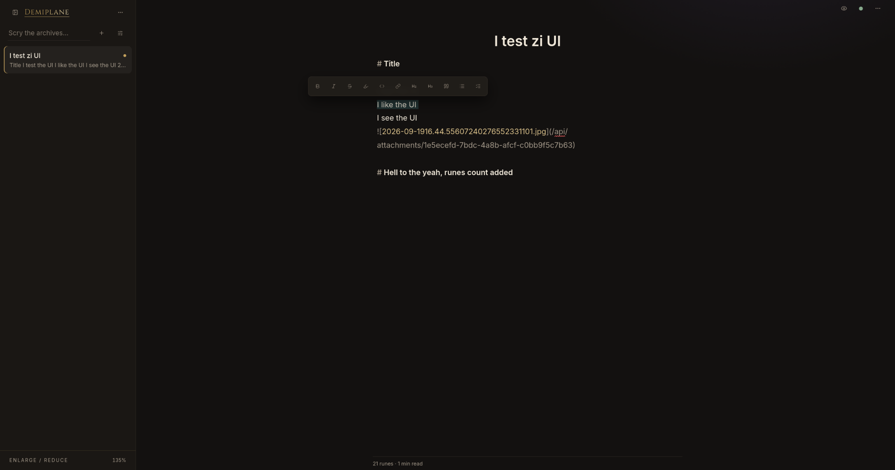
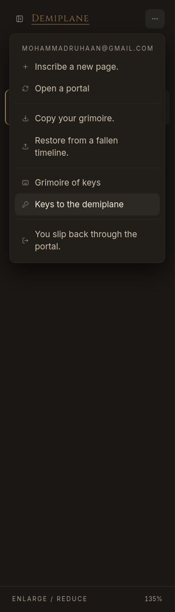
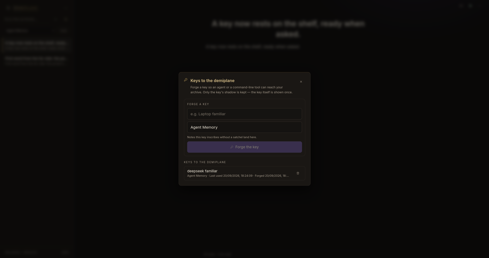
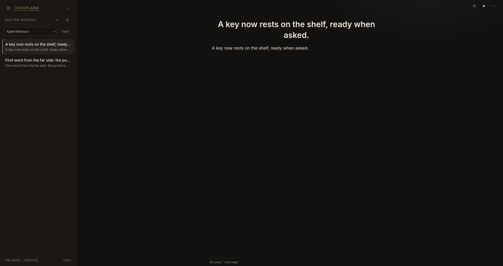

# Demiplane

> Your notes, in a pocket dimension.

A single-user, offline-first notes app that lives on Cloudflare's free tier.
Markdown files in R2 are the source of truth; D1 is a rebuildable index plus
auth/sync state. Take a note from any device with internet, never fight a
corporate network, never pay for someone else's notes service, never get locked
in.

**Live:** https://demiplane.prohan.workers.dev



## Features

- **Passwordless sigil sign-in** — a single-use six-digit code emailed to you,
  self-hosted on your own origin so no third-party auth domain gets blocked. No
  link to follow, so mail scanners cannot consume it, plus a "remember this
  location for a fortnight" session that slides forward as you use it.
- **A CodeMirror 6 markdown canvas with live preview** — autocomplete (`/`,
  `[[`, `#`), a floating selection toolbar, wikilinks with backlinks, callouts,
  and a sanitized preview via `marked` + DOMPurify.
- **A wizard's study, not a dashboard** — Cinzel/Inter/Spectral typography,
  Lucide icons, mobile-first master–detail layout. See
  [`docs/UX.md`](docs/UX.md).
- **Satchels & sigils** (folders & tags) plus instant search.
- **Offline-first** — notes live in IndexedDB (Dexie); edits sync when a
  connection returns. Conflicts keep both versions. Installable PWA.
- **The Haversack** — image/file attachments stored in R2, streamed
  authenticated.
- **Copy your grimoire** — export everything as a portable zip of markdown +
  attachments, and restore it back.
- **Keys to the demiplane** — forge a personal access token in the app so an
  agent or a command-line tool can read and write notes over the API
  (`Authorization: Bearer …`). Keys are hashed at rest, revocable, and carry a
  default satchel.
- **Personality** — every user-facing string carries the flavour. See the
  Flavour Charter in [`AGENTS.md`](AGENTS.md).

## Stack

| Layer | Choice |
| --- | --- |
| Runtime | Cloudflare Workers + Static Assets (`run_worker_first: ["/api/*"]`) |
| Build | `@cloudflare/vite-plugin` + Vite + TypeScript |
| Frontend | React + Tailwind, CodeMirror 6, `marked` + DOMPurify |
| Fonts | Cinzel (display), Inter (UI), Spectral (prose) via `@fontsource` |
| Icons | `lucide-react` |
| Local store | Dexie (IndexedDB) |
| Search | MiniSearch (client-side, offline) |
| PWA | `vite-plugin-pwa` (Workbox) |
| Storage | R2 (notes + attachments), D1 (metadata/sessions/sync) |
| Email | Resend (six-digit login code) |
| Validation | Zod |
| Tests | Vitest |

## Quick start (local)

Requires Node 20+ (built against Node 26).

```bash
npm install
cp .dev.vars.example .dev.vars   # then edit OWNER_EMAIL
npm run db:migrate:local         # apply D1 migrations to the local database
npm run dev                      # http://localhost:5173
```

With `AUTH_DEV_MODE=true` (the default in the example file) the six-digit sign-in
code is returned as `devCode` in the response, so you can sign in without
configuring email: enter the sigil and press **Seal the portal**.

## Commands

```bash
npm run dev                # Vite + Wrangler local dev (local D1 + R2)
npm run build              # type-check + production build
npm run deploy             # build + wrangler deploy
npm test                   # Vitest
npm run typecheck          # tsc --noEmit
npm run db:migrate:local   # apply D1 migrations locally
npm run db:migrate:remote  # apply D1 migrations to the deployed database
```

## Agent access (keys to the demiplane)

Demiplane speaks a plain REST API, so an agent, a script, or a command-line tool
can read and write your notes without a browser. Forge a personal access key in
the app — sidebar **More** menu → **Keys to the demiplane** — and copy it once.

<p align="center">
  
</p>

Every key is stored only as a SHA-256 hash, is labelled and bound to a satchel,
and can be broken at any time. The dialog shows when each key was forged and
last used.



A key carries a **default satchel**. Writes that omit a folder land there — by
default **Agent Memory** — so an agent's notes collect in their own corner of
the archive instead of scattering across your pages.



### The `demiplane` CLI

`cli/demiplane.mjs` is the reference client (Node 20+, no dependencies). From a
checkout use `npm run demiplane --`, or symlink `cli/demiplane.mjs` onto your
`PATH`:

```bash
demiplane config --token dmp_... --url https://demiplane.prohan.workers.dev
# → writes ~/.config/demiplane/config.json (mode 600)

demiplane save "Note for the archive"     # lands in the Agent Memory satchel
echo "piped thought" | demiplane save      # or pipe longer content on stdin
demiplane search "portal"                  # titles, folders, tags, and bodies
demiplane list --folder "Agent Memory"
demiplane get <id>
demiplane rm <id>                          # soft delete — recoverable from the Void
```

`DEMIPLANE_TOKEN` (and optional `DEMIPLANE_URL`) override the stored config, so a
tool can call the REST API directly instead:

```bash
export DEMIPLANE_TOKEN=dmp_...
curl -s https://demiplane.prohan.workers.dev/api/notes \
  -H "Authorization: Bearer $DEMIPLANE_TOKEN" \
  -H "content-type: application/json" \
  -d '{"title":"From an agent","body":"Hello.","folder":null,"tags":[]}'
```

A key may read and write notes but **cannot mint or revoke keys** — only the
signed-in app can do that.

### Teaching an agent to use it

A global opencode skill (`~/.config/opencode/skills/demiplane/SKILL.md`)
triggers on phrases like *"save it to my notebook"*, *"send it to the
demiplane"*, or *"save it to my personal diary"* and writes the content into
**Agent Memory** through the CLI. Point any other agent framework at the same
CLI or API.

## Deploy

```bash
npx wrangler login                # browser OAuth
bash scripts/provision.sh         # create D1 + R2, wire database_id, migrate

npx wrangler secret put OWNER_EMAIL       # the one email allowed to sign in
npx wrangler secret put SESSION_SECRET    # openssl rand -base64 32
npx wrangler secret put RESEND_API_KEY    # https://resend.com/api-keys

npm run deploy
```

R2 requires a one-time subscription checkout (a card on file) even though usage
inside the free tier is $0. Full walkthrough and account requirements live in
[`docs/PLAN.md`](docs/PLAN.md).

## Architecture

```
 Browser / installed PWA (React SPA)
 ├─ IndexedDB (Dexie)  ← offline source of truth
 └─ Service Worker (Workbox)
            │  HTTPS /api/*
            ▼
 Cloudflare Worker
 ├─ Static assets, /api/auth, /api/notes, /api/sync, /api/tokens,
 │  /api/attachments, /api/export, /api/import
        │                    │
        ▼                    ▼
   R2 (markdown truth)    D1 (index, sessions, sync log)
```

- **R2 keys:** `notes/{id}.md`, `attachments/{noteId}/{attachmentId}-{filename}`,
  `trash/notes/{id}.md`. Notes carry YAML frontmatter so exports are
  self-describing.
- **Sync:** monotonic `change_log.seq` cursor — never client clocks. Stale
  writers produce a conflict copy instead of losing data.
- **Auth:** hashed single-use login codes (10 min), hashed session tokens in D1,
  `HttpOnly; Secure; SameSite=Lax` cookie. Agents use hashed personal access
  tokens in `api_tokens` via `Authorization: Bearer`.

## Project layout

```
src/          Worker: router, api/*, lib/* (crypto, session, email, frontmatter)
frontend/     React SPA: components, db (Dexie), sync engine, lib
shared/       Types + the flavour lexicon (single source of both)
migrations/   D1 SQL migrations (numbered, append-only)
scripts/      provision.sh — D1 + R2 setup and remote migrations
cli/          demiplane.mjs — reference agent/CLI client (bearer key)
docs/PLAN.md  Living build plan, deployment log, and risks
AGENTS.md     Agent guide + Flavour Charter (hard requirement)
```

## Cost

Everything fits the free tiers (Workers 100k req/day, D1 5M reads + 100k writes
/day + 5 GB, R2 10 GB + 1M/10M ops, Resend 100 emails/day). Realistically
**$0/month**.
